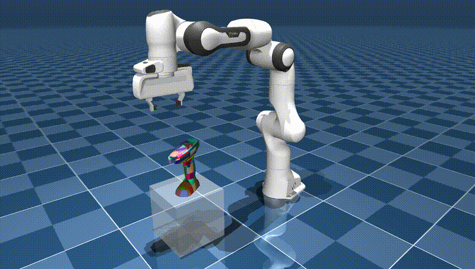

# Disentangled Iterative Surface Fitting for Contact-stable Grasp Planning (DISF)




## Overview

This is the official implementation for the [paper](https://arxiv.org/abs/2502.11535) entitled with "Disentangled Iterative Surface Fitting for Contact-stable Grasp Planning"

## 1-1. Clone the repository

```bash
git clone https://github.com/tomoya-yamanokuchi/disf-official.git
```

-> `DISF_DIR` mentioned below refers to the directory path where the repository is cloned.

## 1-2. Make `data` directory for the output data saved from DISF

```bash
cd <DISF_DIR>
mkdir data
```

## 1-3. Prepare the working environment

The environment can be created in either (A) or (B) method:

### (A) Docker

```bash
cd <DISF_DIR>
sh buld.sh
sh run.sh
```
### (B) Virtual Environment

```bash
uv venv -p 3.11
source .venv/bin/activate
```

## 2. Installation

The below procedures will be conducted inside the docker or virtual environment.

```bash
cd <DISF_DIR>
[uv] pip install -e .
```

## 3. Download YCB object dataset

```bash
python <DISF_DIR>scripts/download_ycb_dataset.py
```

## 4. Apply pre-convex shape approximation

We use [CoACD] for pre-convex shape approximation by
[obj2mjcf].

For **docker only**, run initial setup and check:
```bash
cd <DISF_DIR>/src/obj2mjcf/ & pip install -e .
ls /home/cudagl/.local/bin/obj2mjcf
export PATH=$PATH:/home/cudagl/.local/bin
obj2mjcf --help
```

Apply pre-convex shape approximation:

```bash
cd <DISF_DIR>/scripts/ & ./pre_convex_shape_approximation.sh
```

## 4. Grasp Planning by DISF

We use [MuJoCo] as simulartor and use Franka Emika Panda environment from [MuJoCo Menagerie] for the grasp experiments.

You can try the grasp planning by `DISF`, `VISF` or `CMA-ES`:

```bash
python <DISF_DIR>/test/disf_grasp.py
python <DISF_DIR>/test/visf_grasp.py
python <DISF_DIR>/test/cma_grasp.py
```

## Parameter Settings

You can change the experimental settings by changing parameters in the config files: `disf/src/config_loader/config`

```
config:
 - env              # mujoco simulation parameters
 - grasp_evaluation # grasp evaluation parameters for position and orientation
 - icp              # ICP filtering parameter
 - ik_solver        # inverse kinematics parameters for robot arm reaching
 - isf              # DISF/ISF related parameters
 - cma              # CMA-ES related parameters
 - point_cloud_data # data loading parameters for YCB-object point cloud data
```

[CoACD]: https://github.com/SarahWeiii/CoACD
[obj2mjcf]: https://github.com/kevinzakka/obj2mjcf
[MuJoCo]: https://github.com/deepmind/mujoco
[MuJoCo Menagerie]: https://github.com/deepmind/mujoco_menagerie

